### Домашнее задание к занятию 5. «Практическое применение Docker»- Хрипун Алексей

## Задание 1.
Dockerfile приложения:
```
FROM python:3.12-slim
WORKDIR /app
COPY requirements.txt ./
RUN pip install --no-cache-dir -r requirements.txt
EXPOSE 5000
COPY main.py ./
ARG DB_PASS
ENV DB_HOST="172.20.0.10"
ENV DB_USER="app"
ENV DB_NAME="virtd"
ENV DB_PASSWORD=$DB_PASS
# Запускаем приложение с помощью uvicorn, делая его доступным по сети
CMD ["uvicorn", "main:app", "--host", "0.0.0.0", "--port", "5000"]
```

[img](Dockerfile.python)

Собираем образ командой:
docker build --build-arg DB_PASS=$DB_PASS -f Dockerfile.python -t python_app:1 .

Создаем сеть для контейнеров приложения:
```
docker network create  -d bridge --gateway 172.20.0.1 --subnet 172.20.0.0/24 backend
```
Запускаем образ:
```
docker run -d --name app --network backend --ip 172.20.0.5 -p 5000:5000 python_app:1
```
Проверяем:
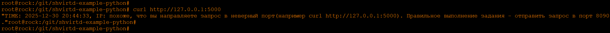

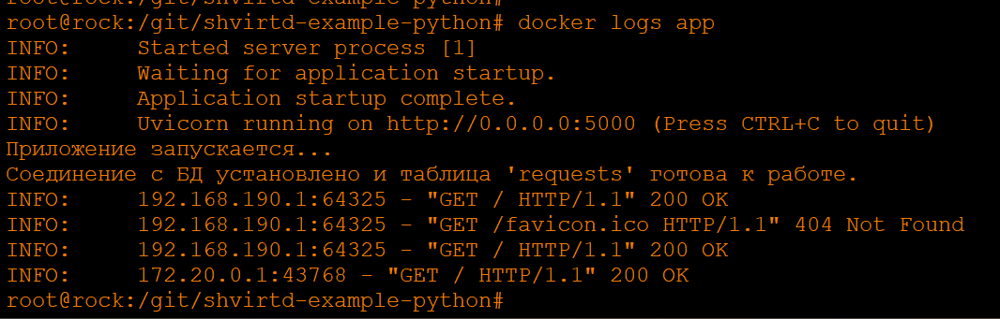

Необходимо создать файл .dockerignore, и заодно .gitignore. В оба файла обязательно нужно поместить файл с паролями **.env**. В .dockerignore также нужно поместить:
```
.git
.env
README.md
proxy.yaml
schema.pdf
Dockerfile.mysql
Dockerfile.python
docker_run.sh
/haproxy/
/nginx/
```


Пробуем запустить приложение без контейнера в виртуальном окружении venv, экспортировав предварительно необходимые переменные:
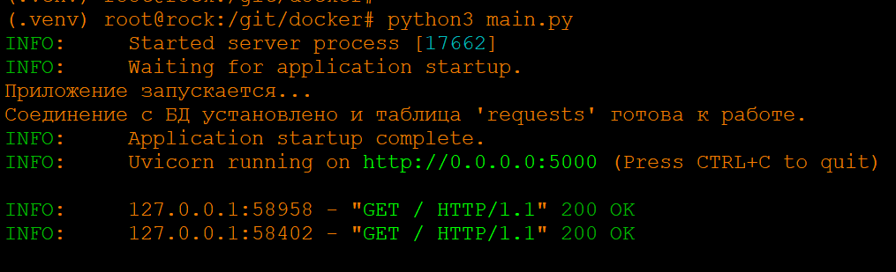


## Задание 2

В репозитории Yandex произведено сканирование образа приложения. Результаты не утешительны, но могло быть и хуже:
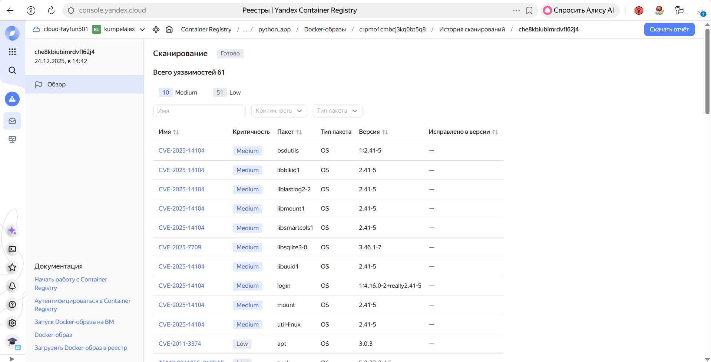

## Задание 3

Запускаем проект Docker compose (). Проверяем возвращение адресов:

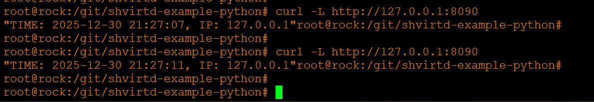

Подключаемся к базе данных и смотрим таблицу:

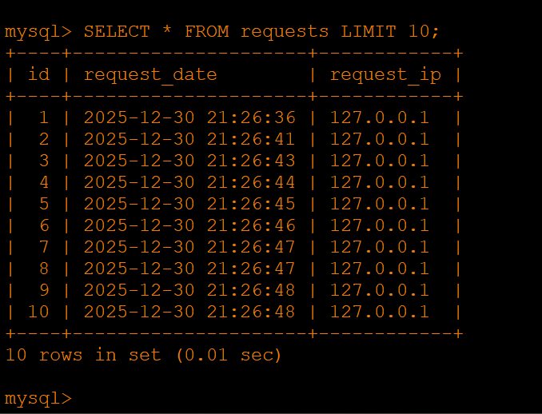

## Задание 4
Скрипт для копирования и запуска проекта:


```
#!/bin/bash
host=$(cat /home/alex/docker_project/ansible/ip-web.txt | tr -d '\r')
key=/home/alex/.ssh/id_ed25519
rsync --rsync-path="sudo rsync" -a -e "ssh -i $key" /git/shvirtd-example-python alex@$host:/opt

ssh -i "$key" alex@$host "docker compose -f /opt/shvirtd-example-python/compose.yaml up -d"
```

Результат:
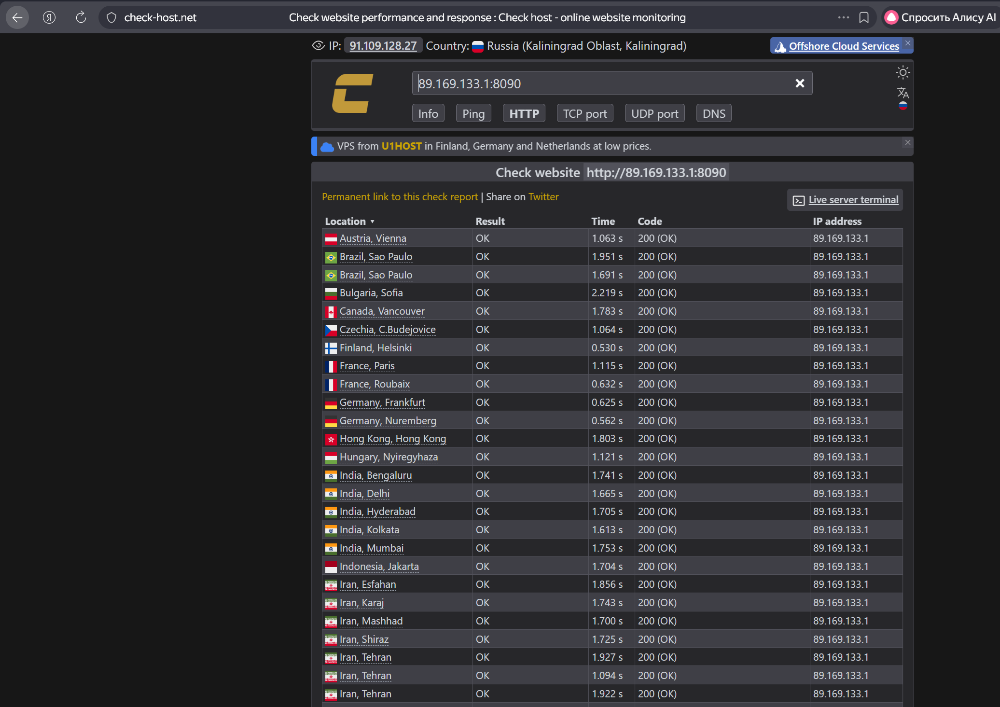

Создаем удаленный контекст:
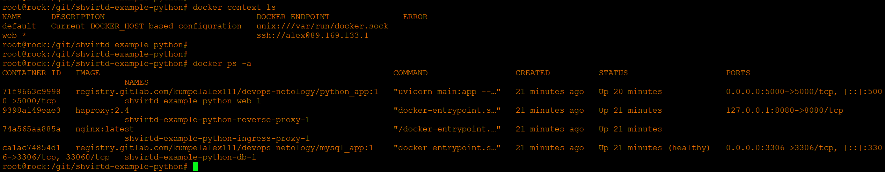

Запрос к базе данных:
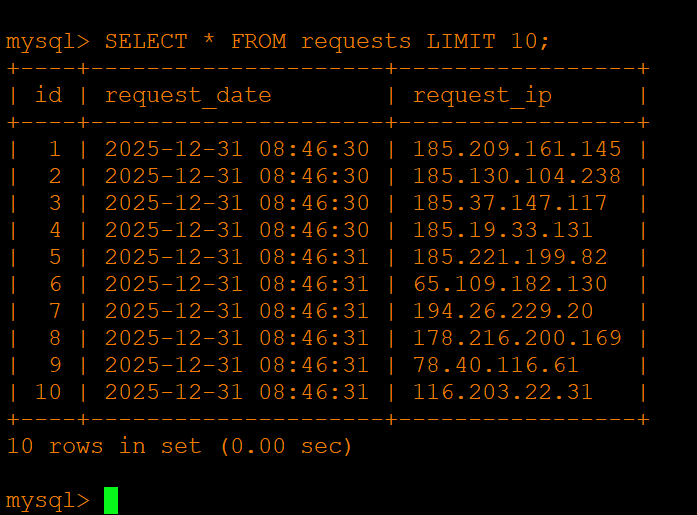

## Задание 6
Запускаем Dive с образом terraform:
```
docker run --rm -it -v /var/run/docker.sock:/var/run/docker.sock wagoodman/dive:latest hashicorp/terraform:latest
```
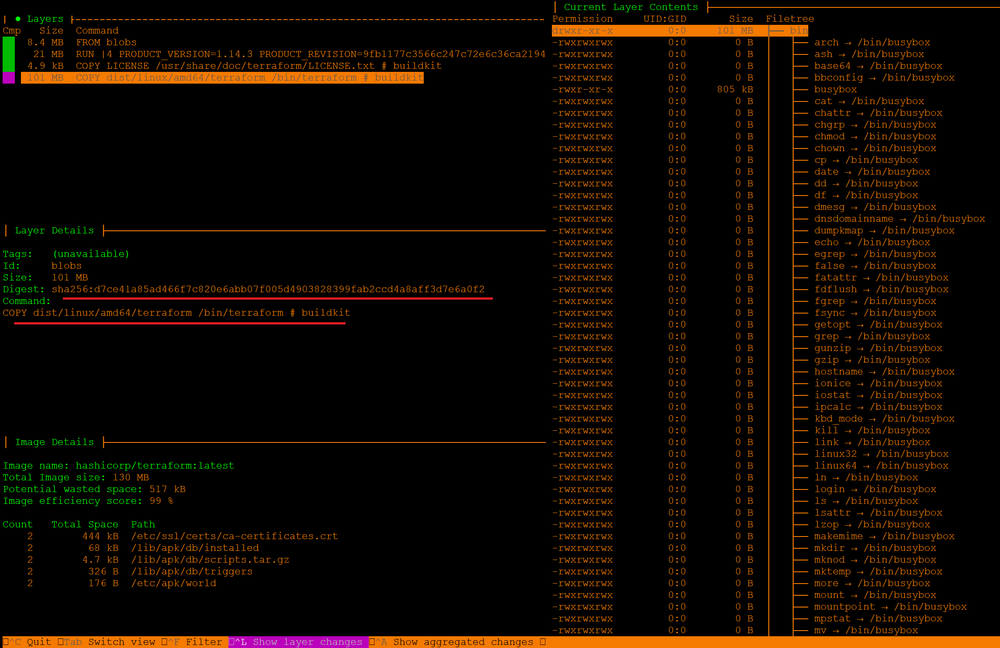

Сохраняем образ:
```
docker save hashicorp/terraform:latest > /distrib/terraform/terraform.tar
```

Распаковываем файл и переходим в каталог blobs/sha256. Здесь находятся файлы слоев. Ещем подходящий по хэшу, который был найдет в Dive:
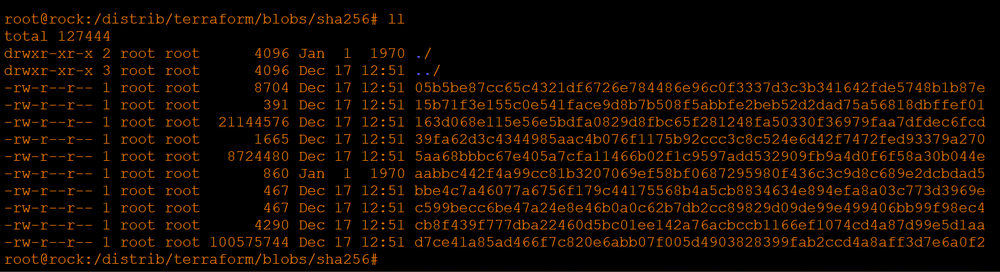

Распаковываем найденный файл:
```
tar xf d7ce41a85ad466f7c820e6abb07f005d4903828399fab2ccd4a8aff3d7e6a0f2
```
Получаем бинарник:
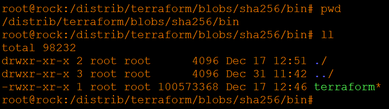

## Задание 6.1

Для упрощения пересобирается исходный образ, чтобы он ничего не делал, только выполнял команду sleep:

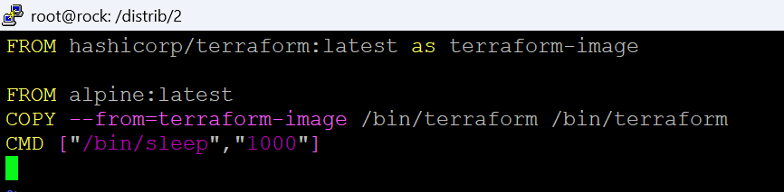

Из запущенного контейнера копируем нужный файл:
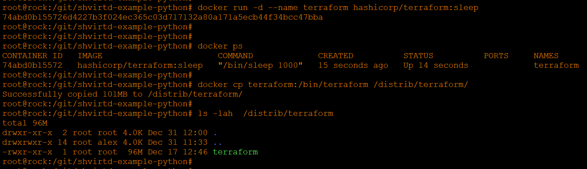

